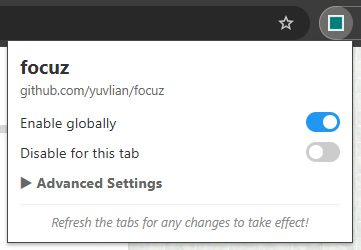

# focuz

dont like websites knowing you have them closed and such? me too.

## setup

1. `git clone https://github.com/yuvlian/focuz.git`
2. open `chrome://extensions` on ur browser.
3. enable developer mode and click load unpacked.
4. select `focuz` dir

## what this spoofs/blocks
1. visibilitychange event
2. webkitvisibilitychange event
3. mozvisibilitychange event
4. pagehide event
5. mouseenter event
6. mouseleave event
7. focusin event
8. focusout event
9. focus event
10. blur event
11. requestAnimationFrame (ms/sec)
